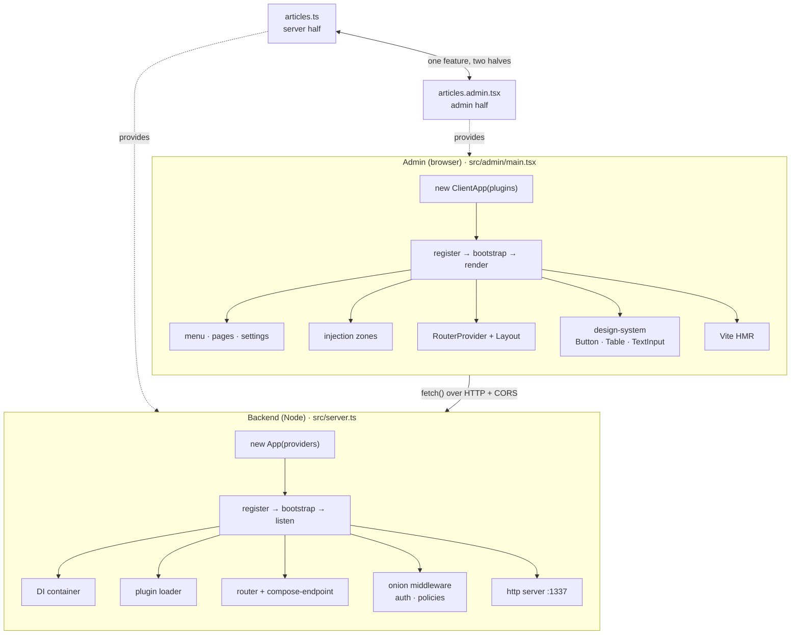
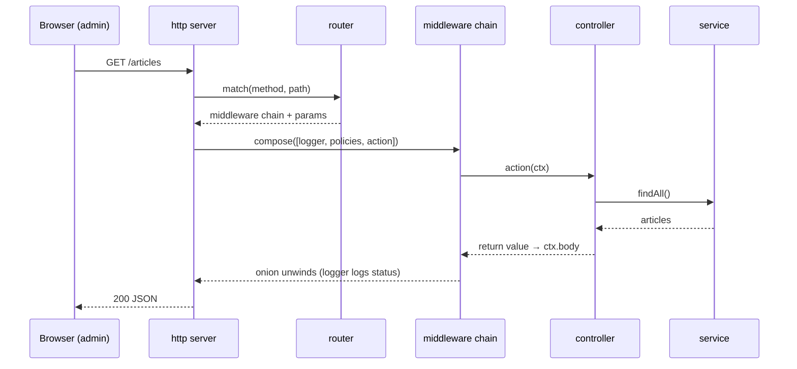

# nano-strapi

A tiny **full-stack plugin framework** built from scratch in TypeScript — a Node backend **and** a React admin — that re-implements the core architecture of [Strapi](https://github.com/strapi/strapi) in ~2,000 readable lines.

It distills the machinery most frameworks spread across thousands of files into something you can read in an afternoon: a dependency-injection container, a plugin system, a lifecycle, an onion-middleware HTTP server, and a React admin with hot reload, injection zones, and a shared design-system.

- **Backend** — DI container, provider lifecycle (`register → bootstrap → start`), plugin loader, declarative router, onion middleware (`compose`/`next`) written from scratch, and an HTTP server on Node's built-in `http`.
- **Admin** — a `StrapiApp`-style client with the same lifecycle and registries, React Router, **Vite HMR**, plugin-contributed menus/pages/settings, **injection zones** (plugins extend each other's UI), and a reusable **design-system**.
- **Server/admin split** — each plugin has a server half and an admin half in **separate modules**, so browser code never bundles `node:http` and server code never bundles React.

> **Who this is for:** developers who want to understand how plugin-based frameworks boot, serve requests, and assemble a UI — and contributors onboarding to a large codebase like Strapi's. Every module maps to a real Strapi file (see [the mapping](#how-this-maps-to-strapi)).

---

## Quick start

Two processes, exactly like Strapi's `yarn watch` + `yarn develop`:

```bash
npm install

# Terminal 1 — the backend API (auto-restarts on change)
npm run dev:server        # http://localhost:1337

# Terminal 2 — the React admin with hot reload
npm run dev:admin         # http://localhost:5173
```

Open **http://localhost:5173**: a sidebar, an Articles page (filter + table, data fetched live from the API), an Export button injected by a *different* plugin, and a Settings area.

```bash
npm test                  # run the test suite (vitest)
npm run typecheck         # strict TypeScript, no emit
npm run build:admin       # production build of the admin
```

---

## Architecture



Same lifecycle on both sides (`register → bootstrap`), one feature split into a server half and an admin half, and the admin fetching from the backend over HTTP — so the two run and deploy independently.

### Request lifecycle

What happens when the admin loads the Articles page:



A `POST` adds one step: a policy in the chain checks auth and, if it fails, never calls `next()` — so the controller never runs and the request short-circuits with a 403.

## Project structure

```
src/
├── server.ts                 # backend entry: boot the App + seed data
├── admin/main.tsx            # admin entry: build ClientApp, mount React
├── core/                     # the SERVER framework
│   ├── container.ts          #   DI container: register/get, lazy + cached
│   ├── app.ts                #   App class = container + lifecycle
│   ├── plugins.ts            #   plugin loader (data → behavior)
│   ├── router.ts             #   path matching (:params → regex)
│   ├── compose-endpoint.ts   #   handler string → [policies, action] chain
│   ├── register-routes.ts    #   "initRouting": build routes after plugins load
│   ├── compose.ts            #   onion middleware (koa-compose) from scratch
│   ├── server.ts             #   Node http server: req → ctx → compose → response
│   └── types.ts              #   Provider, Plugin, Route, Context, Policy…
├── client/                   # the ADMIN framework
│   ├── client-app.ts         #   ClientApp = StrapiApp: registries + lifecycle + render
│   ├── Layout.tsx            #   app shell (sidebar + <Outlet/>)
│   ├── SettingsLayout.tsx    #   /settings shell (sub-menu + <Outlet/>)
│   ├── injection.tsx         #   AppContext + useApp() + <InjectionZone/>
│   └── types.ts              #   AdminPlugin, MenuItem, Page, SettingsPage…
├── design-system/            # shared UI library (like @strapi/design-system)
│   ├── Button.tsx  Table.tsx  TextInput.tsx
│   └── useSelectOnFocus.ts   #   select text on keyboard focus (contributed upstream)
└── plugins/
    ├── articles.ts           # articles SERVER half (routes/controllers/services/policy)
    ├── articles.admin.tsx    # articles ADMIN half (menu/pages/settings/component)
    ├── export.admin.tsx      # admin-only plugin: injects a button into the articles page
    └── users.ts              # a second server plugin
```

### Core ideas

**1. Everything is data first, behavior second.** A plugin is a plain object declaring what it *has* (routes, controllers, services, menu, pages). The framework collects that data at boot and turns it into running behavior. That's why a route can say `handler: 'article.find'` (a string) and have it resolve to a real function.

**2. Dependency injection decouples everything.** Services don't import each other; they ask the container by name. Swap an implementation without touching callers.

**3. Lifecycle phases encode ordering.** `register` (everyone introduces themselves) must finish before `bootstrap` (wire things up) — routes can't resolve controllers until controllers exist. The admin uses the same two phases.

**4. The server/admin split is structural.** Server and admin halves are separate modules with separate entry points, because the browser can't bundle `node:http` and the server shouldn't bundle React. Adding a feature = adding a plugin to an array; nothing else changes.

**5. Injection zones make it a platform.** A page renders `<InjectionZone name="..."/>`; any plugin calls `app.injectComponent(name, C)`. Plugins extend each other's UI through a shared string, with zero cross-imports — the essence of an extensible platform.

---

## How this maps to Strapi

| nano-strapi | Strapi |
| --- | --- |
| `core/container.ts` | `strapi.add()` / `strapi.get()` |
| `core/app.ts` | the `Strapi` class |
| Provider + provider loop | `packages/core/core/src/providers/` |
| `core/plugins.ts` | `loaders/plugins/index.ts` (`loadPlugins`) |
| `core/compose-endpoint.ts` | `services/server/compose-endpoint.ts` |
| `core/compose.ts` | `koa-compose` |
| `core/server.ts` | the Koa server |
| `client/client-app.ts` | `StrapiApp` (`admin/src/StrapiApp.tsx`) |
| `admin/main.tsx` | `renderAdmin()` (`admin/src/render.ts`) |
| `client/injection.tsx` | `InjectionZone` + `useStrapiApp` |
| `design-system/` | `@strapi/design-system` |
| `articles.ts` / `articles.admin.tsx` | `strapi-server` / `strapi-admin` |

---

## Why the architecture looks like this

A "normal" app imports everything at build time. A **framework** can't: it's extended by plugins it has never seen, installed by other people, without editing its source. The registries + lifecycle + injection zones are the **extension API** that makes that possible — the same reason VSCode, WordPress, and Webpack look "over-engineered" next to a single app. The indirection *is* the feature.

## Status & scope

Intentionally minimal — a reference implementation, **not** a Strapi replacement. It deliberately omits a real database, validation, RBAC, i18n, content-type schemas, auth, and a build pipeline, to keep the architecture legible. Each commit corresponds to one build stage, so the git history reads as a guided construction of the framework.

## License

MIT
